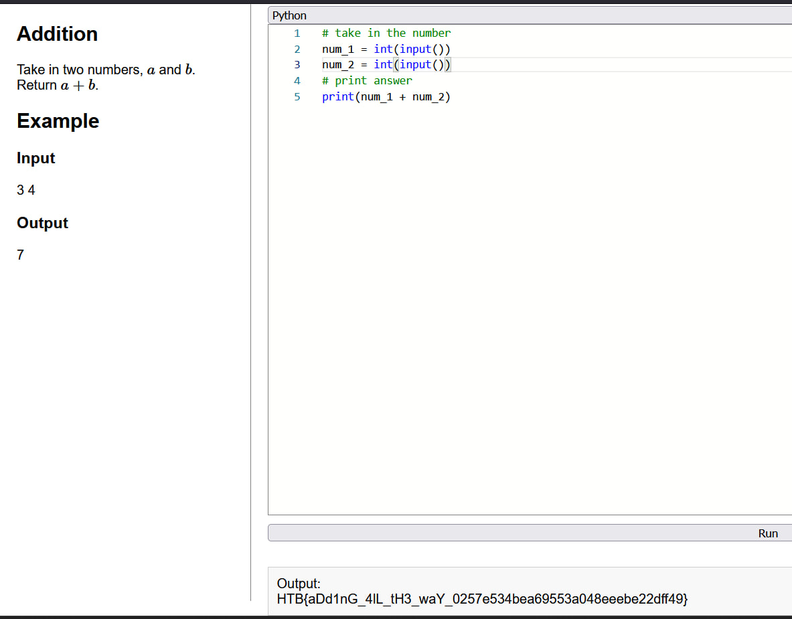

Sarcina:
```
Two ancient runes hold hidden powers. Combine them to unlock the sum and reveal their secret.
```

Codul pentru sarcina:
```python
# take in the number
num_1 = int(input())
num_2 = int(input())

# print answer
print(num_1 + num_2)
```



Flagul este: `HTB{aDd1nG_4lL_th3_waY_0257e534bea69553a048eeebe22dff49}`
