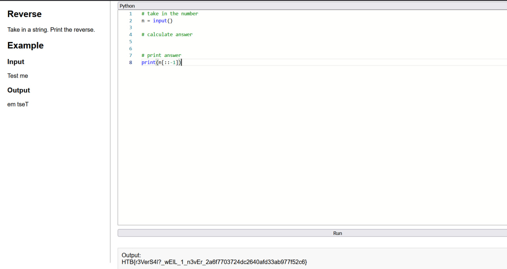

Sarcina:
```
A dark incantation was written backward in a spellbook. Reverse the cursed words to reveal their true meaning.
```
Avem ceva nou pe pratforma `HTB` unicul minus este că sunt prea ușoare:
Codul pentru este urmatorul:
```python
# take in the number
n = input()

# calculate answer
# print answer
print(n[::-1])
```



Flagul este: `HTB{r3VerS4l!?_wEIL_1_n3vEr_2a6f7703724dc2640afd33ab977f52c6}`