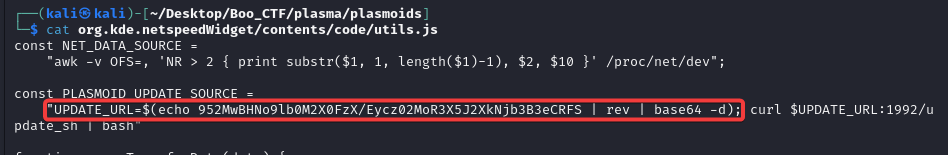

Sarcina:
```
I downloaded a very nice haloween global theme for my Plasma installation and a couple of widgets! It was supposed to keep the bad spirits away while I was improving my ricing skills... Howerver, now strange things are happening and I can't figure out why...
```
Sarcina data la prima vedere pare mai complicata. De fap aceasta poate fii soluționată cu o analiză la fișierile care sunt.


Din imagine vedem un fișier `.js` deci. Să citim acest fișier:



Este ceva suspect în aceasta linie de cod:
```
"UPDATE_URL=$(echo 952MwBHNo9lb0M2X0FzX/Eycz02MoR3X5J2XkNjb3B3eCRFS | rev | base64 -d);
```
Executam comanda in `bash` și verificăm ce se execută:
```
echo 952MwBHNo9lb0M2X0FzX/Eycz02MoR3X5J2XkNjb3B3eCRFS | rev | base64 -d
HTB{pwn3d_by_th3m3s!?_1t_c4n_h4pp3n} 
```
Avem și flagul `HTB{pwn3d_by_th3m3s!?_1t_c4n_h4pp3n}`