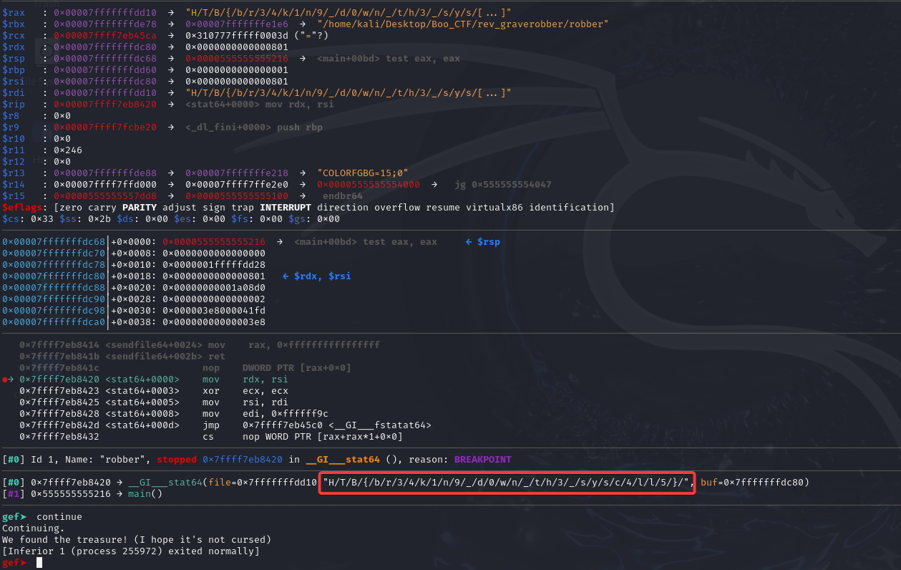

Sarcina:
```
We're breaking into the catacombs to find a rumoured great treasure - I hope there's no vengeful spirits down there...
```

Programul care este executabil verifică calea către un fișier specific și daca acesta nu este întoarce erroare:
De fapt fișierul dat este și flagul nostru putem pune un `break stat` și să rulăm executabilul `run` și să continuăm cu commanda `continue`:



Flagul este: `HTB{br34k1n9_d0wn_th3_sysc4ll5}`