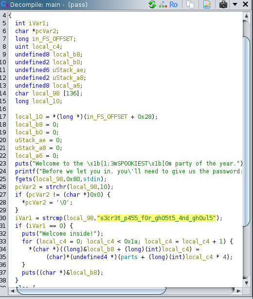
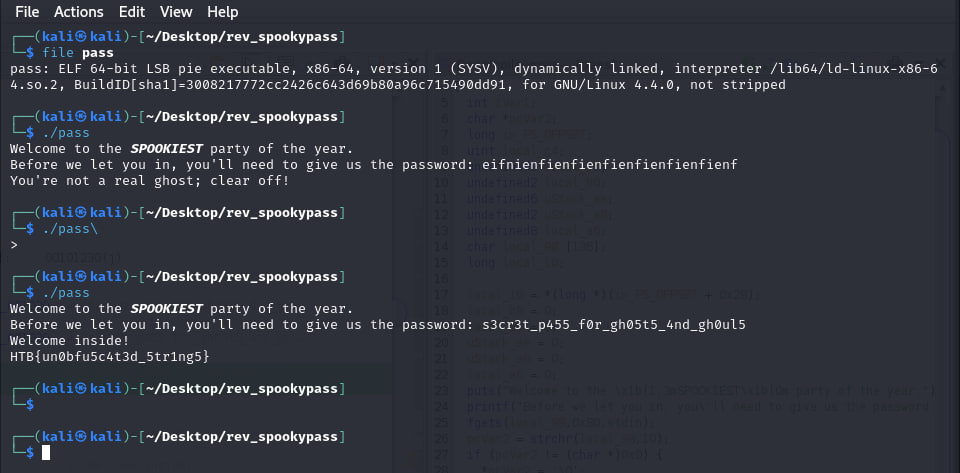

Sarcina:
```
All the coolest ghosts in town are going to a Haunted Houseparty - can you prove you deserve to get in?
```

Utilizăm ghidra pentru a vedea care este codul pentru programul nostru executabil:



Avem passwordul în plain-text tot ce trebuie să facem să rulăm programul compilat și să introducem parola:



Flagul este: `HTB{un0bfu5c4t3d_5tr1ng5}`