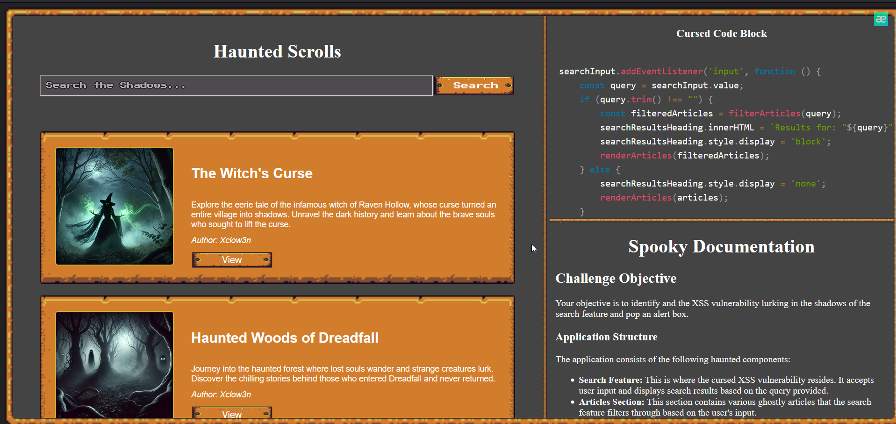
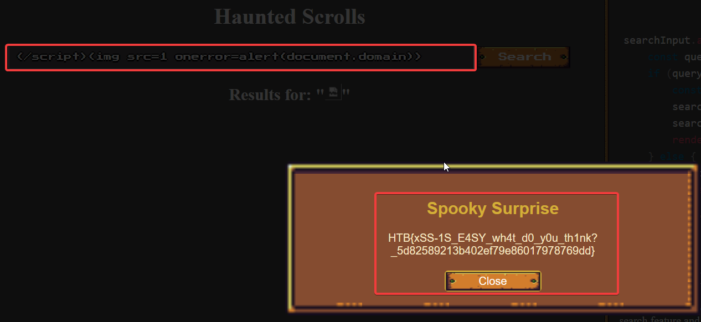

Sarcina:
```
Note: Wait for the bot to trigger your payload. It might take around ~10 seconds. Every Halloween, an enigmatic blog emerges from the depths of the dark web—Phantom's Script.
Its pages are filled with cursed writings and hexed code that ensnare the souls of unwary visitors. The blog's malicious scripts weave dark secrets into the fabric of the internet,
spreading corruption with each click. Rumor has it that interacting with the site in unexpected ways can trigger hidden incantations.
Will you dare to delve into this haunted scroll, manipulate the scripts, and purge the malevolent code before it claims more victims?
```

Acesăm adresa noastră și vedem urmatoarea:

Codul `.js`:
```js
searchInput.addEventListener('input', function () {
    const query = searchInput.value;
    if (query.trim() !== "") {
        const filteredArticles = filterArticles(query);
        searchResultsHeading.innerHTML = `Results for: "${query}"`;
        searchResultsHeading.style.display = 'block';
        renderArticles(filteredArticles);
    } else {
        searchResultsHeading.style.display = 'none';
        renderArticles(articles);
    }
```
Avem o vulnerabilitate de tipul `XSS` acesam `https://book.hacktricks.xyz/pentesting-web/xss-cross-site-scripting` și putem vedea ceva de genu:
```
</script>
```
Un bypass cum să executam codul nostru:



Dupa exploatarea vulnerabilități avem și flagul: `HTB{xSS-1S_E4SY_wh4t_d0_y0u_th1nk?_5d82589213b402ef79e86017978769dd}`