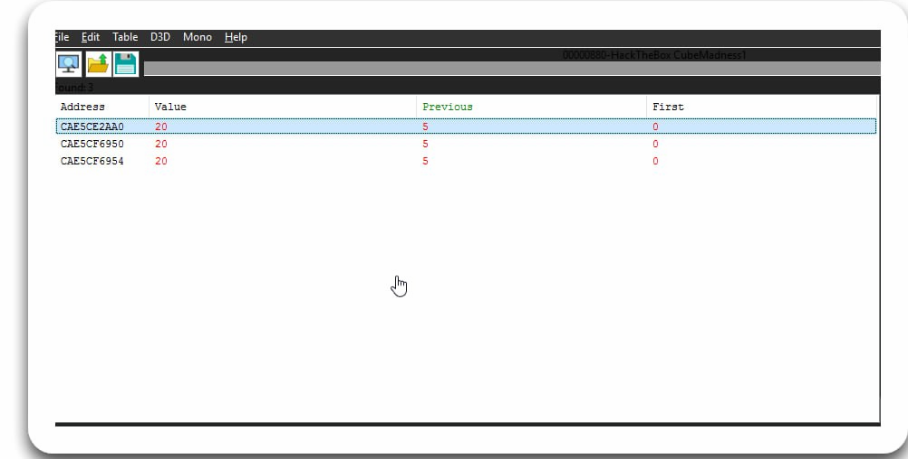

## Task
```
Gotta collect them all.
```
Dupa ce am dezarhivat arhiva am primit multe fisiere si un `.exe` care este si jocul nostru. Conditia acestui joc este sa acumulam 20 de `cubes` dar in joc sunt doar 6.
La inceput am incercat sa folosesc `grep`-ul ca sa gases flagul un plain text:
```bash
h1p@h1p-LapBook-Pro:~/CTF/HackTheBox_CTF/GamePwn/Cube_Madness1$ grep -r "HTB" gamepwn_cubemadness1/
grep: gamepwn_cubemadness1/HackTheBox CubeMadness1_Data/globalgamemanagers.assets: binary file matches
h1p@h1p-LapBook-Pro:~/CTF/HackTheBox_CTF/GamePwn/Cube_Madness1$ grep -r --binary-files=without-match "HTB" gamepwn_cubemadness1/
```
Dar nu am primit flagul.
Dupa acesta am rulat aplicatie pe windows si am incercat cu `Cheat Engine`. Am gasit memoria care raspunde de variabela dat si am schimbata la 20.

Dupa ce am schimbat valoarea primim:

Flagul este:
`HTB{CU83_M4DN355_UNM4DD3N3D}`