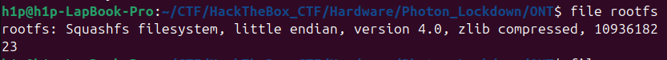
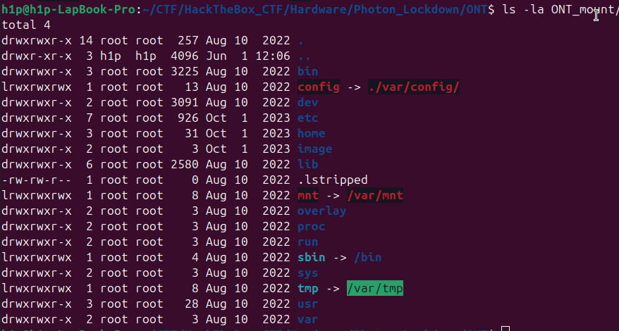
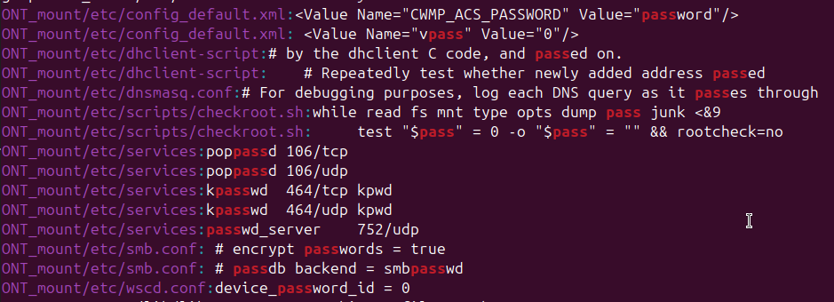
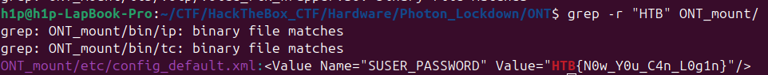

# Sarcina 
```
We've located the adversary's location and must now secure access to their Optical Network Terminal to disable their internet 
connection. Fortunately, we've obtained a copy of the device's firmware, which is suspected to contain hardcoded credentials.
Can you extract the password from it?
```
Este un chalenge de tipul hardware la care trebuie sa depistam care este parola hardcodata:
### Metoda 1 
Daca facem un file la fisierul `rootfs` vedem urmatoare informatie:

Acest tip de fisier(`squashfs`)  poate fii montat la sistemul nostru cu comanda:
```bash
sudo mount -t squashfs rootfs ONT_mount/
```
In cazul dat `ONT_mount` este directoriul unde sunt montat:
Dupa montare vom fii capabil sa vedem structura fisierului dar unde sa gasim parola?:


In cazul dat am utilizat grepul si am incercat sa caut dupa cuvantul `pass`(de fapt trebuie sa caut dupa `HTB` formatul la flag)
```bash
grep -r "pass" ONT_mount
```

In cazul dat primim fisierile care posibil contin flagul:


Daca inlocuim `pass` cu `HTB` vom primi flagul:
```bash
grep -r "HTB" ONT_mount/
```


Flagul este `HTB{N0w_Y0u_C4n_L0g1n}`
