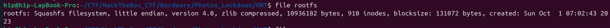

### Sarcina 
```
We've located the adversary's location and must now secure access to their Optical Network Terminal to disable their internet connection. Fortunately, we've obtained a copy of the device's firmware, which is suspected to contain hardcoded credentials. Can you extract the password from it?
```
Este un chalenge de tipul hardware la care trebuie sa depistam care este parola hardcodata:
### Metoda 1 
Daca facem un file la fisierul `rootfs` vedem urmatoare informatie:
