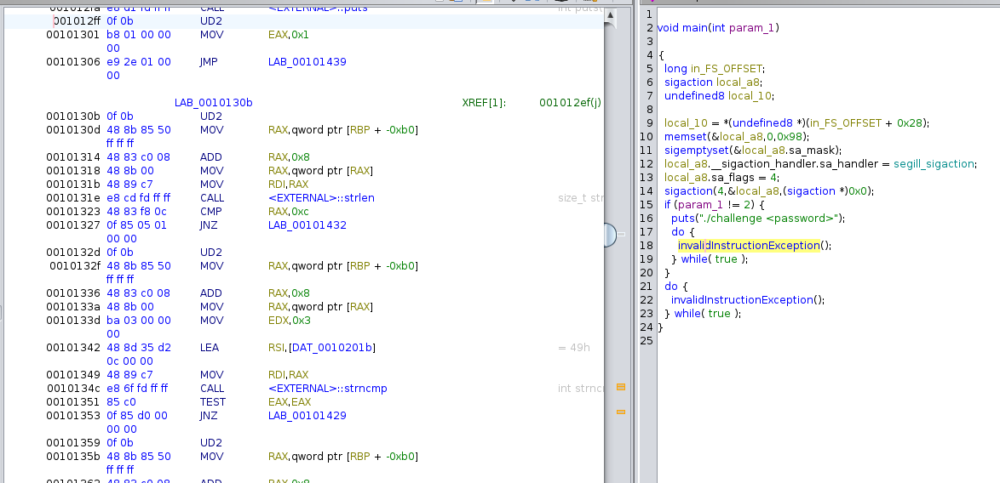
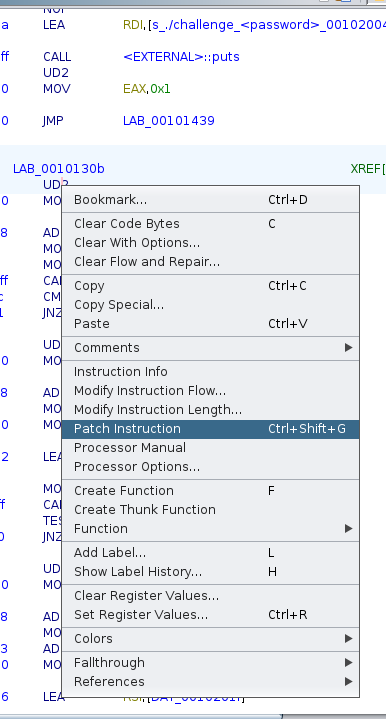
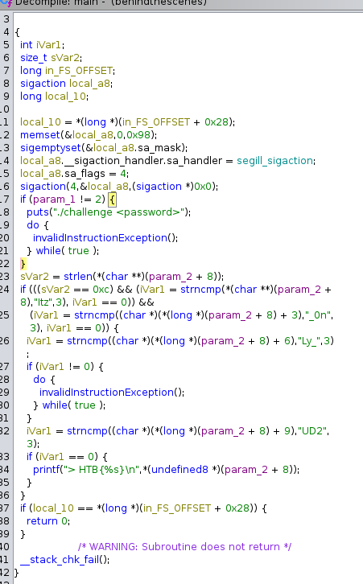

## Task
```
After struggling to secure our secret strings for a long time, we finally figured out the solution to our problem: Make decompilation harder. It should now be impossible to figure out how our programs work!
```
Este o sarcina de tipul `Reversing` ca sa fii completat trebuie sa stium unele instructiuni:


In imaginea de sus vedem instructiunea `UD2` care este o instructiune de depanare sau de securitate dar in acest car ascunde codul:
Trebuie sa schimbam `UD2` pe `NOP`(instructiune care nu face nimic). 


Schimbam `UD2` pe `Nop` si ne privim main si codul:


Flagul este `HTB{Itz_0nLy_UD2}`