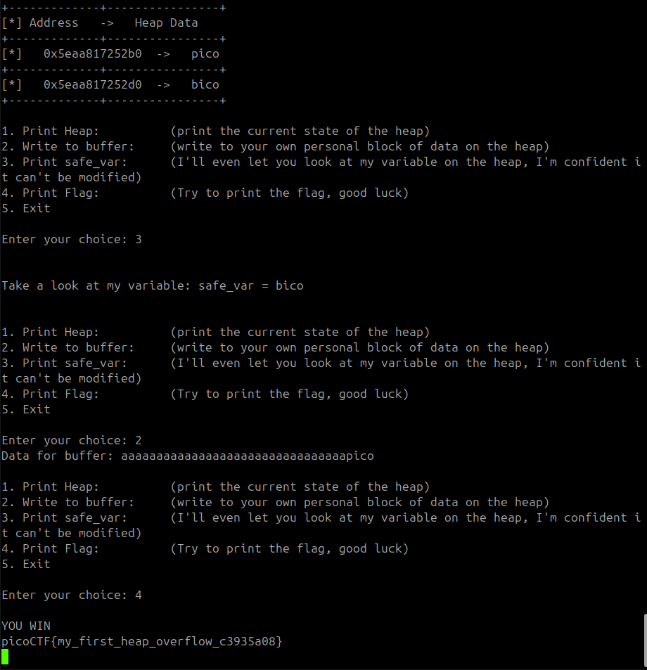

Avem 2 fisiere unul codul sursa altul deja compilat ce e straniu e ca avem adresele. Daca calculam cate characteres sunt intre acestea adrese primim rezultatul de 32 deci mai departe scrim deja in variabela noastra secreta.

Flagul `picoCTF{my_first_heap_overflow_c3935a08}`
