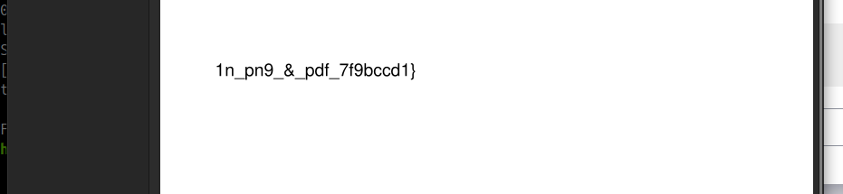

Daca facem un file la fișierul acesta putem vedea ca este un PNG dar dupa extensie este PDF tot ce trebuie sa facem sal deschidem cu 2 programe una pentru PDF reder și alta pentru PNG 

Part 1: `picoCTF{f1u3n7_`

Part 2: `1n_pn9_&_pdf_7f9bccd1}`
Flagul este: `picoCTF{f1u3n7_1n_pn9_&_pdf_7f9bccd1}`
