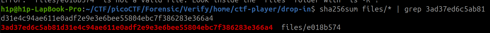
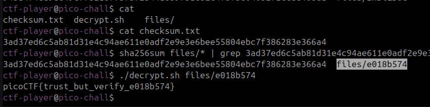

## Verify
Este un chalenge simplu trebuie sa gases fisierul care corespunde cu hash-ul din fisier:
`3ad37ed6c5ab81d31e4c94ae611e0adf2e9e3e6bee55804ebc7f386283e366a4`
```bash
sha256sum files/* | grep 3ad37ed6c5ab81d31e4c94ae611e0adf2e9e3e6bee55804ebc7f386283e366a4
```


Conectam pe server rulam scriptul cu fisierul():
```bash
./decrypt.sh files/e018b574
```

Flagul `picoCTF{trust_but_verify_e018b574}`
