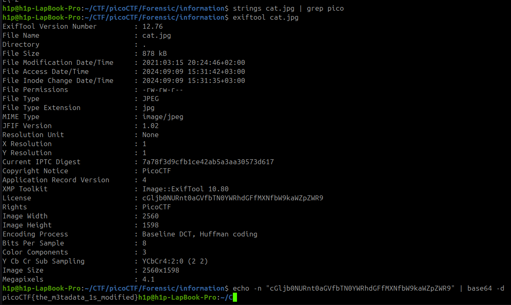

Sarcina:
```
Files can always be changed in a secret way. Can you find the flag? cat.jpg
```

Am încercat să găsesc flagul cu un simplu `string` dar nu lam gasit



Flagul este: `picoCTF{the_m3tadata_1s_modified}`
