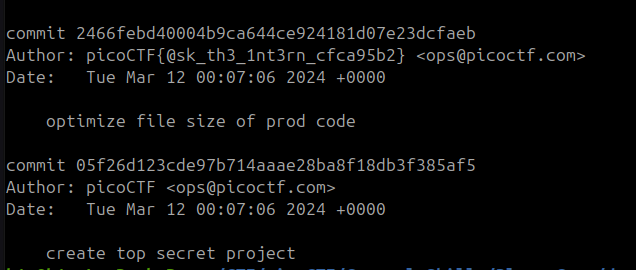

In cazul dat nu o sa fie de ajuns sa revenim la un commit precedent ca sa gasim flagul deoarece sunt multe commituri dar daca facem un grep e posibil sa vedem flagul in user

Flagul `picoCTF{@sk_th3_1nt3rn_cfca95b2}`
