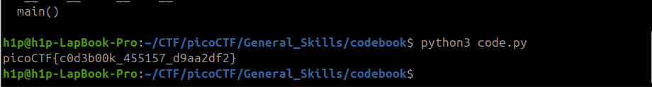

Sarcina: 
```
Run the Python script code.py in the same directory as codebook.txt.
    Download code.py
    Download codebook.txt
```
Cel mai easy ce poate sa fie trebui să rulez scriptul `code.py` și primim flagul



Flagul este: `picoCTF{c0d3b00k_455157_d9aa2df2}`