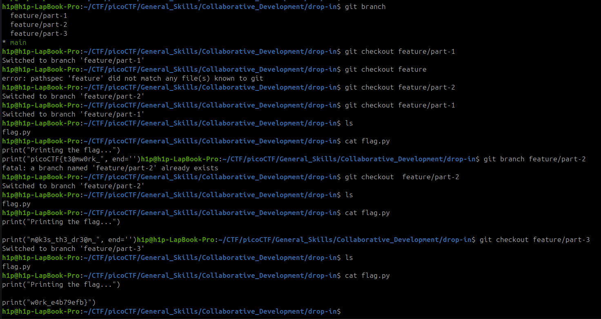

În sarcina data trebuie să gasim flagul în diferite bracnch.
  feature/part-1
  feature/part-2
  feature/part-3
* main
Deci avem 3 părți din
1 - `picoCTF{t3@mw0rk_`
2 - `m@k3s_th3_dr3@m_`
3 - `w0rk_e4b79efb}` 

Flagul este: `picoCTF{t3@mw0rk_m@k3s_th3_dr3@m_w0rk_e4b79efb}`