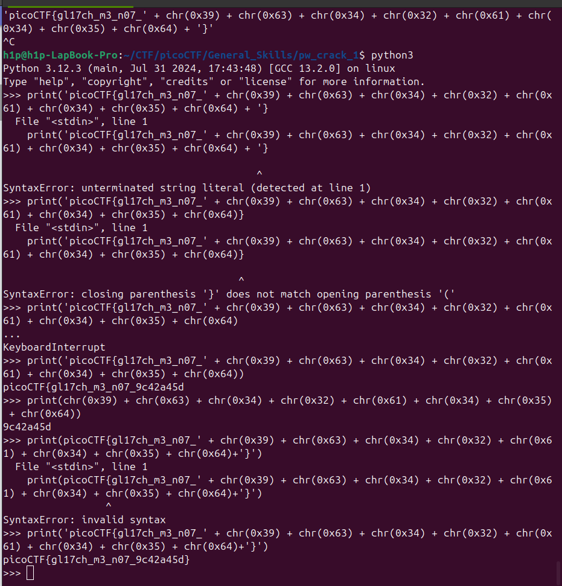

Daca ne conectam cu `nc` putem sa vedem ca ne întoarce o bucată de flag și rezstul care este în format de `chr`. Tot ce trebuie să facem e să printam caracterile care nu sunt printate.

Flagul este: `picoCTF{gl17ch_m3_n07_9c42a45d}`
