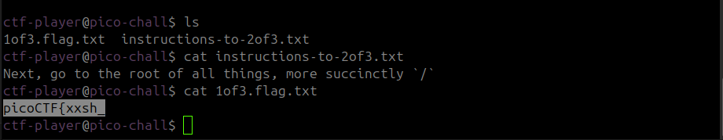
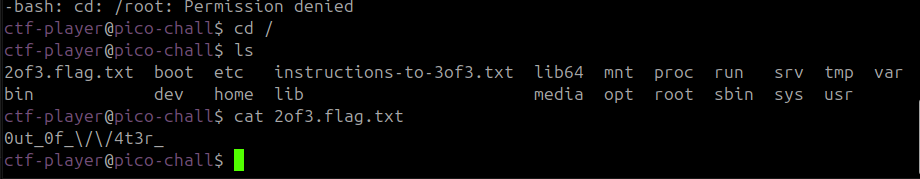
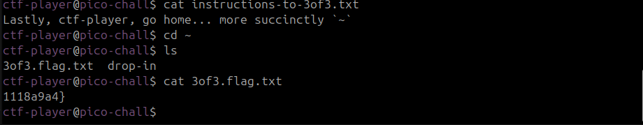

Sarcina:
```
Do you know how to move between directories and read files in the shell? Start the container, `ssh` to it, and then `ls` once connected to begin. Login via `ssh` as `ctf-player` with the password, `481e7b14`
```
Trebuie să ne connectăm la un server prin ssh și să gasim flagul 
Prima parte: `picoCTF{xxsh_`


Partea a doua: `0ut_0f_\/\/4t3r_`



Partea a triea: `1118a9a4}`



Flagul este: `picoCTF{xxsh_0ut_0f_\/\/4t3r_1118a9a4}`
