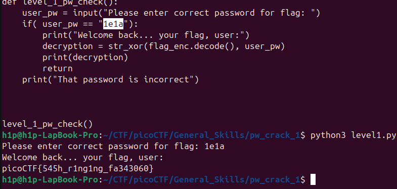

Este un script scris pe python care cripteaza flagul nostru cu un `xor` dar care poate fii decriptat cu funcția deja care este în acesta ștind parola care este în plain text. 

Flagul este: `picoCTF{545h_r1ng1ng_fa343060}`
