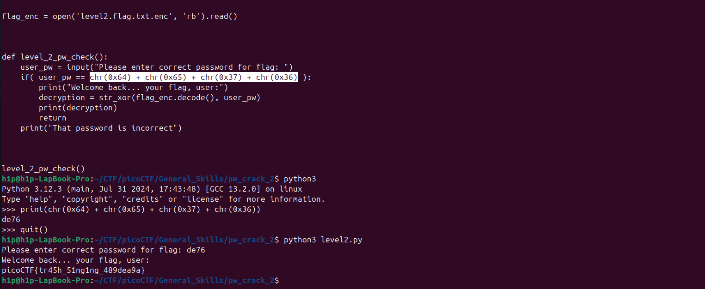

Avem un script în python care criptează fișierul nostru adica flagul dar virificarea la decriptare se face printrun password simplu care în cazul dat este scris în forma de `chr()`

Flagul este: `picoCTF{tr45h_51ng1ng_489dea9a}`
