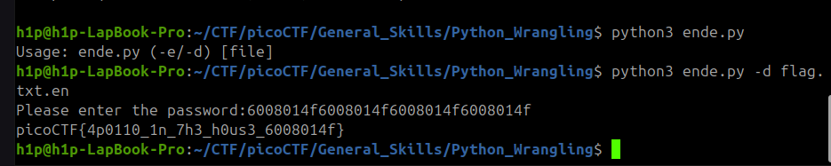

Sarcina:
```
Python scripts are invoked kind of like programs in the Terminal...
Can you run this Python script using this password to get the flag?
```

Tot ce trebuie sa facem ca să trecem trebuie să rulăm scriptul cu flagul criptat și să introducem parola easy peasy



Flagul este: `picoCTF{4p0110_1n_7h3_h0us3_6008014f}`

