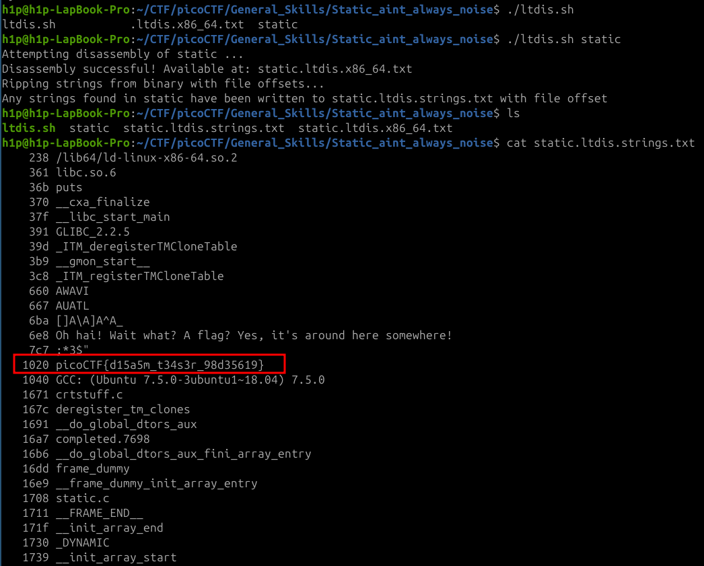

Sarcina:
```
Can you look at the data in this binary: static? This BASH script might help!
```
Este o sarcina simpla avem un script pe `bash` si programul compilat. Tot ce trebuie e sa stransmitem programul compilat in scriptul nostru.



Flagul este: `picoCTF{d15a5m_t34s3r_98d35619}`
