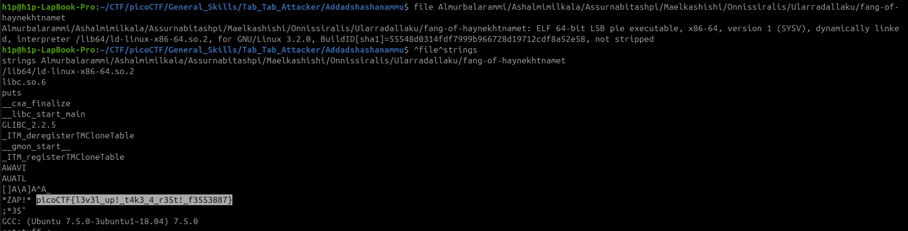

Sarcina: 
```
Using tabcomplete in the Terminal will add years to your life, esp. when dealing with long rambling directory structures and filenames: Addadshashanammu.zip
```
Este un zip cu mai multe directoare și un fișier executabil cu ajutorul la `Tab` putem rezolva.



Flagul este: `picoCTF{l3v3l_up!_t4k3_4_r35t!_f3553887}`