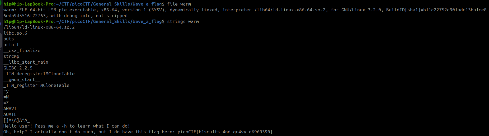

Sarcina:
```
Can you invoke help flags for a tool or binary? 
This program has extraordinarily helpful information...
```

Este un fișier care este compilat deci putem primi flagul cu un singur



Flagul este: `picoCTF{b1scu1ts_4nd_gr4vy_d6969390}`