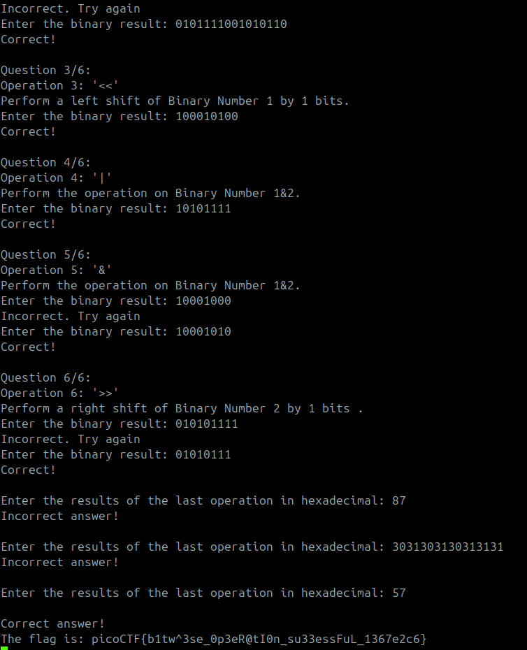

Sarcina:
```
How well can you perfom basic binary operations?
Start searching for the flag here <instance>
```
În sarcina data trebuie să aplicam unele operațiune pentru biți.
1. '+'
2. '*'
3. '<<' 
Toți biții se mută cu o poziție spre stânga.
Se adaugă un 0 în locul liber din dreapta.
4. '|'
Operația OR (|) compară fiecare bit al celor două numere și returnează:
    1 dacă unul dintre biți este 1 (sau ambele sunt 1),
    0 doar dacă ambii biți sunt 0.
5. '&'
Operația AND (&) compară fiecare bit al celor două numere și returnează:
    1 doar dacă ambii biți sunt 1,
    0 dacă unul sau ambii biți sunt 0.
6. '>>' la fel ca și '<<' dar că în direcția inversă.



Flagul este: `picoCTF{b1tw^3se_0p3eR@tI0n_su33essFuL_1367e2c6}`