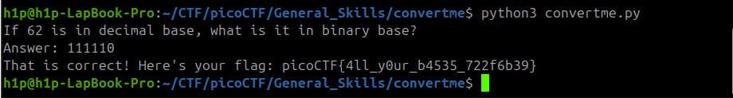

Sarcina:
```
Run the Python script and convert the given number from decimal to binary to get the flag.
Download Python script
```
Trebuie să transformăm cifrele care sunt în decimal în formatul de binary



Flagul este: `picoCTF{4ll_y0ur_b4535_722f6b39}`