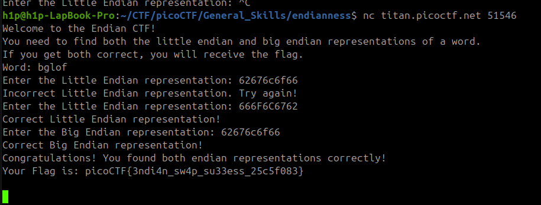

În sarcina dată avem un code sursă care trebuie să fie analizat și de înțeles logica la program. 
Pentru a trece prima verificare trebuie să introducem valoarea la stringul generat în hex dar
invers de la urma spre început
A doua verificare este hex pur care trebuie să fie introdus în verificare

Flagul este: 'picoCTF{3ndi4n_sw4p_su33ess_25c5f083}'
