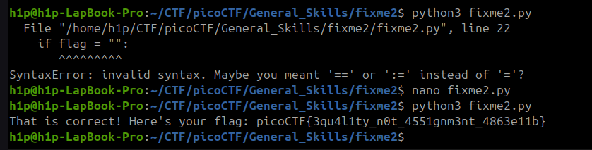

Sarcina:
```
Fix the syntax error in the Python script to print the flag.
Download Python script
```
Tot ce trebuie să facem este să corectăm un `=` în `==` și primim flagul.



Flagul este: `picoCTF{3qu4l1ty_n0t_4551gnm3nt_4863e11b}`