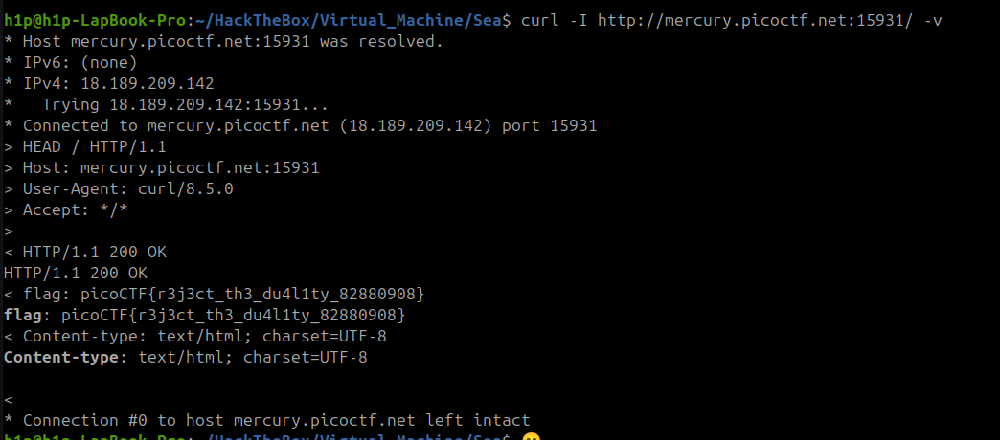

Sarcina:
```
Find the flag being held on this server to get ahead of the competition http://mercury.picoctf.net:15931/
```
Sarcina data poate fii rezolvată prin BurpSuite așa și prin un `curl` obișnuit
`culr -I -v http://mercury.picoctf.net:15931/` 



Flagul este: `picoCTF{r3j3ct_th3_du4l1ty_82880908}`

