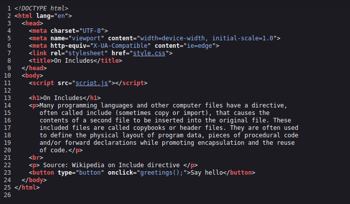
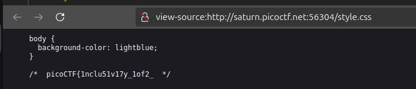
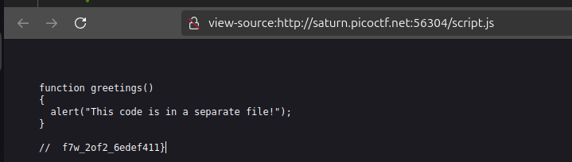

Pe acest site avem fișierile unde este și flagul nostru.

Flagul este înpărțit în 2 parți în fișierul `.css` și `.js` 

Partea de css `picoCTF{1nclu51v17y_1of2_`

Flagul complex este `picoCTF{1nclu51v17y_1of2_f7w_2of2_6edef411}`