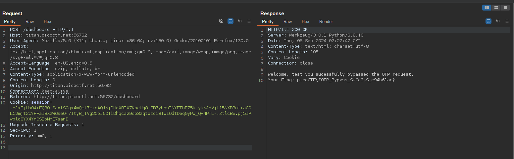

Este o sarcina stranie la primul rân am crezut că trebuie să fac brute la OTP deoarece lipsesc unel mecanice pentru securitate din partea asta. 
Dar este mai simplu transmite requestul fara nimic și primim flagul 

Acestea este requestul unde utilizatorul transmite OTP în loc de asta trasmitem nimic =) 
Flagul este: `picoCTF{#0TP_Bypvss_SuCc3$S_c94b61ac}`
