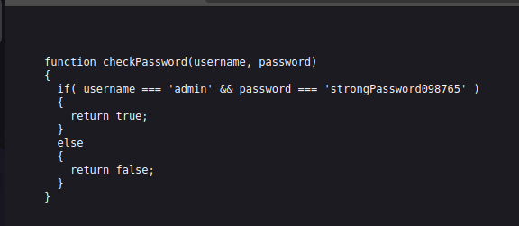

Sarcina:
```
Can you get the flag?
Go to this website and see what you can discover.
```
Flagul este ascuns sub o forma de autentificare dar daca facem un insert la code putem vedea ca `.js` este scris în același document.


Aici putem vedea ca este un fișier cu denumirea de `secure.js` în care este cod în plain text.



Vedem credințialele urmatoare:
```
admin
strongPassword098765
```
Deci dacă le logam cu urmatoarele credințiale primim flagul.


Flagul este: `picoCTF{j5_15_7r4n5p4r3n7_b0c2c9cb}`